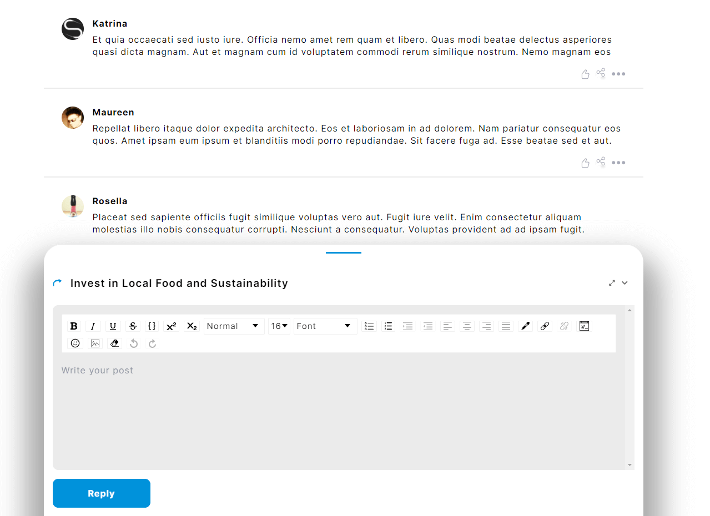

# Runing the project
```js
yarn
``` 
to install or 
```js
npm install
```

# Create .env in the application root

## Add a variable
```js
REACT_APP_GITHUB_URL=http://localhost:3000/
```

# After installing the dependencies and variable

```js
yarn start
```
# Demo
https://innovationcast-challenge.vercel.app/

# Home Page
 
